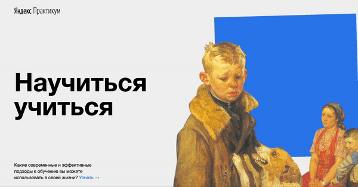

<h1 align="center">Научиться учиться</h1>

## Описание

<h2 align="center"></h2>

Проект одностраничного сайта, который рассказывает о различных техниках эффективного обучения. Подготовлен в рамках обучения по программе Веб-разработчик на платформе **Яндекс.Практикум**.

<h2 align="center">
  
</h2>

## Технологии
### HTML
- Нативный html 5
- iframe
- Api YouTube
### CSS
- Flexbox
- Анимация и трансформация
### Иное
- Методология БЭМ для разметки, CSS и построения файловой структуры проекта.
##Планы
- Заменить Flexbox на Grid для отработки последнего.

